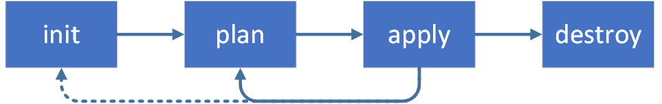
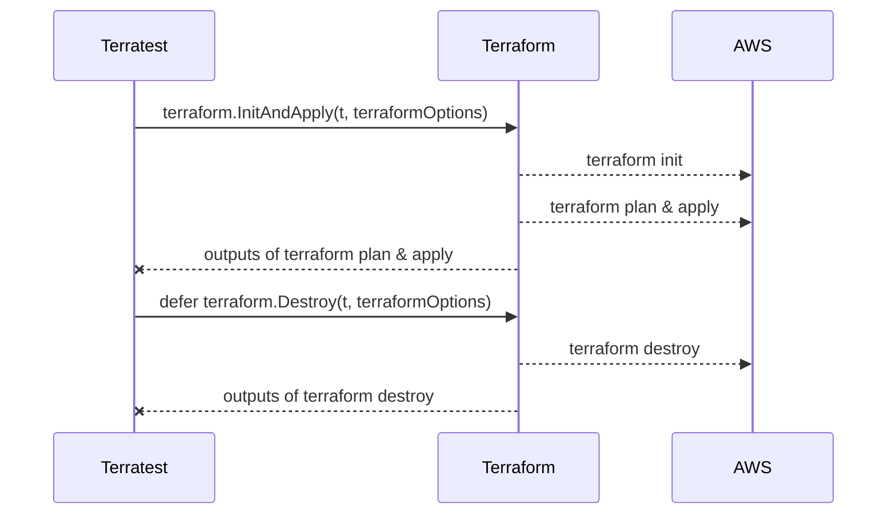

# terraform-aws-module-vpc


AWS Virtual Private Cloud (VPC) Module via Terraform & Unit Test Case via GoLang.
This module provides functionality for creating an vpc with following functionality:

* Subnets (IPv4 / IPv6)  
  * public  
  * private  
  * database  
* Routing (IPv4 / IPv6)  
  * Internet Gateway  
  * NAT Gateway  
  * Virtual Private Gateway  
  * Transit Gateway  
  * VPC Peering  

## Pre-Requirements

* Terraform `v1.0.4`
* Go `v1.17.2`

### VSCode IDE Extensions (Optional)
* HashiCorp Terraform
* Terraform
* Terraform Completer
* Go
* Markdown Preview Mermaid Support

## Terraform Core-Concepts

It would be able to see terraform core-concept which command will be execute on the project.

| Command | Description ||
|---|---|---|
| `terraform init` | Initializes the working directory which consists of all the configuration files. | 
| `terraform plan` | Plan is used to create an execution plan to reach a desired state of the infrastructure. Changes in the configuration files are done in order to achieve the desired state. |
| `terraform apply` | Apply then makes the changes in the infrastructure as defined in the plan, and the infrastructure comes to the desired state. |
| `terraform destroy`| destroy is used to delete all the old infrastructure resources, which are marked tainted after the apply phase. |




Second point of view is terraform lifecycle which will be execute for running like that:
```
➜  test git:(dev) ✗ terraform init
Initializing modules...

Initializing the backend...

Initializing provider plugins...
- Reusing previous version of hashicorp/aws from the dependency lock file
- Using previously-installed hashicorp/aws v3.70.0

Terraform has been successfully initialized!

You may now begin working with Terraform. Try running "terraform plan" to see
any changes that are required for your infrastructure. All Terraform commands
should now work.

If you ever set or change modules or backend configuration for Terraform,
rerun this command to reinitialize your working directory. If you forget, other
commands will detect it and remind you to do so if necessary.

```

## Unit-Test 

First step of running existing unit-test cases on terraform-aws-module-vpc is define the which terraform modules execution on AWS Account that :
```
➜  terraform-aws-module-vpc git:(dev) ✗ cd unit-test 
➜  unit-test git:(dev) ✗ export AWS_PROFILE=arbade-aws
➜  unit-test git:(dev) ✗ terraform init
Initializing modules...

Initializing the backend...

Initializing provider plugins...
- Reusing previous version of hashicorp/aws from the dependency lock file
- Using previously-installed hashicorp/aws v3.70.0

Terraform has been successfully initialized!

You may now begin working with Terraform. Try running "terraform plan" to see
any changes that are required for your infrastructure. All Terraform commands
should now work.

If you ever set or change modules or backend configuration for Terraform,
rerun this command to reinitialize your working directory. If you forget, other
commands will detect it and remind you to do so if necessary.
➜  unit-test git:(dev) ✗ ls -la 
total 56
drwxr-xr-x  9 demira  1977418181   288 Dec 31 14:45 .
drwxr-xr-x  9 demira  1977418181   288 Dec 31 15:29 ..
-rw-r--r--  1 demira  1977418181   330 Dec 30 16:24 main.tf
-rw-r--r--  1 demira  1977418181  1775 Dec 31 15:11 vpc_test.go
-rw-r--r--  1 demira  1977418181   228 Dec 31 15:04 test_output.tf

```
## Unit-Test Sequence Diagram



## Parameters

| Parameter | Description | Default |
|---|---|---|
| `name` | Name to be used on resources as identifier | null (**required**) |
| `env` | Environment to be used on resources as identifier | null |
| `cidr` | A CIDR Block notation of the whole VPC | null (**required**) |
| `azs` | List of AZs the VPC should be built in | **["eu-central-1a", "eu-central-1b", "eu-central-1c"]** |
| `instance_tenancy` | A tenancy option for instances launched into the VPC | **default** |
| `enable_ipv6` | Should be false if you do not want IPv6 | **false** |
| `enable_public_subnets` | Switch to create public subnets | **false**  
| `enable_private_subnets` | Switch to create private subnets | **false** |
| `enable_database_subnets` | Switch to create database subnets | **false** |
| `enable_ddns` | Set to enable DDNS in forward and reverse dns zone | **false** |
| `enable_dynamodb_endpoint` | Should be true if you want to provision a DynamoDB endpoint to the VPC | **false** |  
| `enable_s3_endpoint` | Should be true if you want to provision an S3 endpoint to the VPC | **false** |
| `dns_parent_zone` | DNS parent zone in which the namespace is integrated in (acme.com) | null (**required** if `enable_ddns`) |   
| `enable_nat_gateway` | Should be true if you want to provision NAT Gateways for each of your private networks | **false** |
| `enable_vpn_gateway` | Should be true if you want to create a new VPN Gateway resource and attach it to the VPC | **false** |
| `vpn_gateway_asn` | Should be 16bit or 64bit ASN for VPN Gateway | **null** |
| `vpn_propagate_private_routes` | Should be true if you need route table propagation | **false** |  
| `vpn_customer_gateways` | List of maps of VPN Transit Gateways | **[{}]** |
| `enable_transit_gateway` | Whether to enable Transit Gateway support | **false** |
| `transit_gateway_id` | ID of Transit Gateway | null (**required** if `enable_transit_gateway`) |  
| `transit_gateway_propagations` | List of Transit Gateway Attachment IDs to propagate into Transit Gateway Route Table | **[]** |  
| `transit_gateway_static_routes` | List of Map of Transit Gateway Attachment ID and static route to propagate into Transit Gateway Route Table | **[{}]** |  
| `vpc_peering_ids` | List of VPC Peering IDs to associate with | **[]** |

## CIDR Blocks
### VPC
| Name          | CIDR Block    |
|---------------|---------------|
| VPC-Arbade-Dev | 10.100.0.0/24 |

### Subnets

| Name                      | CIDR Blocks     |
|---------------------------|-----------------|
| Public-dev-eu-central-1a  | 10.100.16.0/28  |
| Public-dev-eu-central-1b  | 10.100.32.0/28  |
| Public-dev-eu-central-1c  | 10.100.48.0/28  |
| Private-dev-eu-central-1a | 10.100.96.0/28  |
| Private-dev-eu-central-1b | 10.100.112.0/28 |
| Private-dev-eu-central-1c | 10.100.128.0/28 |


## Details
### Subnetting
#### IPv4
As we want to care about ReverseDNS it is much simpler to use **/24** CIDR blocks.
If we use a maximum of 3 different subnet types in up to 5 different AZs, we would fit with one **/20** CIDR block per VPC...

#### IPv6
The module is also capable of configuring IPv6 for the subnets.
Since AmazonAWS is providing a /56 Prefix per VPC we could simply split this into /64 blocks.

#### Internet / NAT Gateway
Public subnets will get an Internet Gateway per default while Private Subnets will get a NAT-Gateway per AZ when `enable_nat_gateway` is true.  
All Subnets have IPv6 routing available if `enable_ipv6` is true.


### Transit Gateway
Ths module is capable of attaching the VPC to a given AWS Transit Gateway, which could be in a different account reflected by the additional `aws.connect` provider.

```hcl
enable_transit_gateway = true
transit_gateway_id     = data.aws_ec2_transit_gateway.connect.id

transit_gateway_propagations = [
  data.aws_ec2_transit_gateway_vpn_attachment.different_vpc.id,
  data.aws_ec2_transit_gateway_vpn_attachment.vpn.id
]

transit_gateway_static_routes = [
  {
    attachment_id = "data.aws_ec2_transit_gateway_vpn_attachment.additional_vpn.id"
    route         = "172.XX.XXX.0/24"
  },
  {
    attachment_id = "data.aws_ec2_transit_gateway_vpn_attachment.additional_vpn.id"
    route         = "172.XX.XXX.0/24"
  }
]
```

## Testing

```shell
➜  test git:(main) ✗ go test -v vpc_test.go
=== RUN   Test_ShouldBeCreateAndDestroyVPC
=== PAUSE Test_ShouldBeCreateAndDestroyVPC
=== CONT  Test_ShouldBeCreateAndDestroyVPC
Test_ShouldBeCreateAndDestroyVPC 2022-08-22T14:46:54+03:00 test_structure.go:95: Copied terraform folder ../test to /var/folders/t8/f0l9swq56kd03hfqjl3z5dhj91r2d7/T/Test_ShouldBeCreateAndDestroyVPC3966530040/terraform-aws-module-vpc/test
Test_ShouldBeCreateAndDestroyVPC 2022-08-22T14:46:54+03:00 region.go:92: Using region eu-central-1
Test_ShouldBeCreateAndDestroyVPC 2022-08-22T14:46:54+03:00 region.go:140: Looking up all availability zones available in this account for region eu-central-1
    vpc_test.go:47: Running Terraform Init and Apply
Test_ShouldBeCreateAndDestroyVPC 2022-08-22T14:46:55+03:00 retry.go:91: terraform [init -upgrade=false]
Test_ShouldBeCreateAndDestroyVPC 2022-08-22T14:46:55+03:00 logger.go:66: Running command terraform with args [init -upgrade=false]
Test_ShouldBeCreateAndDestroyVPC 2022-08-22T14:46:55+03:00 logger.go:66: Initializing modules...
Test_ShouldBeCreateAndDestroyVPC 2022-08-22T14:46:55+03:00 logger.go:66: - vpc_test in ..


* * *

Test_ShouldBeCreateAndDestroyVPC 2022-08-22T14:47:10+03:00 logger.go:66: Terraform has been successfully initialized!
Test_ShouldBeCreateAndDestroyVPC 2022-08-22T14:47:10+03:00 logger.go:66: 
Test_ShouldBeCreateAndDestroyVPC 2022-08-22T14:47:10+03:00 logger.go:66: You may now begin working with Terraform. Try running "terraform plan" to see
Test_ShouldBeCreateAndDestroyVPC 2022-08-22T14:47:10+03:00 logger.go:66: any changes that are required for your infrastructure. All Terraform commands
Test_ShouldBeCreateAndDestroyVPC 2022-08-22T14:47:10+03:00 logger.go:66: should now work.
Test_ShouldBeCreateAndDestroyVPC 2022-08-22T14:47:10+03:00 logger.go:66: 
Test_ShouldBeCreateAndDestroyVPC 2022-08-22T14:47:10+03:00 logger.go:66: If you ever set or change modules or backend configuration for Terraform,
Test_ShouldBeCreateAndDestroyVPC 2022-08-22T14:47:10+03:00 logger.go:66: rerun this command to reinitialize your working directory. If you forget, other
Test_ShouldBeCreateAndDestroyVPC 2022-08-22T14:47:10+03:00 logger.go:66: commands will detect it and remind you to do so if necessary.
Test_ShouldBeCreateAndDestroyVPC 2022-08-22T14:47:10+03:00 retry.go:91: terraform [apply -input=false -auto-approve -lock=false]
Test_ShouldBeCreateAndDestroyVPC 2022-08-22T14:47:10+03:00 logger.go:66: Running command terraform with args [apply -input=false -auto-approve -lock=false]

* * * 

Test_ShouldBeCreateAndDestroyVPC 2022-08-22T14:50:10+03:00 logger.go:66: Apply complete! Resources: 27 added, 0 changed, 0 destroyed.
Test_ShouldBeCreateAndDestroyVPC 2022-08-22T14:50:10+03:00 logger.go:66: 
Test_ShouldBeCreateAndDestroyVPC 2022-08-22T14:50:10+03:00 logger.go:66: Outputs:
Test_ShouldBeCreateAndDestroyVPC 2022-08-22T14:50:10+03:00 logger.go:66: 
Test_ShouldBeCreateAndDestroyVPC 2022-08-22T14:50:10+03:00 logger.go:66: cidr_block = "10.100.0.0/24"
Test_ShouldBeCreateAndDestroyVPC 2022-08-22T14:50:10+03:00 logger.go:66: private_subnet_cidr_block = [
Test_ShouldBeCreateAndDestroyVPC 2022-08-22T14:50:10+03:00 logger.go:66:   "10.100.0.96/28",
Test_ShouldBeCreateAndDestroyVPC 2022-08-22T14:50:10+03:00 logger.go:66:   "10.100.0.112/28",
Test_ShouldBeCreateAndDestroyVPC 2022-08-22T14:50:10+03:00 logger.go:66:   "10.100.0.128/28",
Test_ShouldBeCreateAndDestroyVPC 2022-08-22T14:50:10+03:00 logger.go:66: ]
Test_ShouldBeCreateAndDestroyVPC 2022-08-22T14:50:10+03:00 logger.go:66: private_subnets = [
Test_ShouldBeCreateAndDestroyVPC 2022-08-22T14:50:10+03:00 logger.go:66:   "subnet-xxx",
Test_ShouldBeCreateAndDestroyVPC 2022-08-22T14:50:10+03:00 logger.go:66:   "subnet-xxx",
Test_ShouldBeCreateAndDestroyVPC 2022-08-22T14:50:10+03:00 logger.go:66:   "subnet-xxx",
Test_ShouldBeCreateAndDestroyVPC 2022-08-22T14:50:10+03:00 logger.go:66: ]
Test_ShouldBeCreateAndDestroyVPC 2022-08-22T14:50:10+03:00 logger.go:66: public_subnet_cidr_blocks_one = tomap({
Test_ShouldBeCreateAndDestroyVPC 2022-08-22T14:50:10+03:00 logger.go:66:   "Name" = "eu-central-1a"
Test_ShouldBeCreateAndDestroyVPC 2022-08-22T14:50:10+03:00 logger.go:66:   "Project" = "Terratest-Arbade-Vpc-Sparrow-Test"
Test_ShouldBeCreateAndDestroyVPC 2022-08-22T14:50:10+03:00 logger.go:66: })
Test_ShouldBeCreateAndDestroyVPC 2022-08-22T14:50:10+03:00 logger.go:66: public_subnet_cidr_blocks_three = tomap({
Test_ShouldBeCreateAndDestroyVPC 2022-08-22T14:50:10+03:00 logger.go:66:   "Name" = "eu-central-1c"
Test_ShouldBeCreateAndDestroyVPC 2022-08-22T14:50:10+03:00 logger.go:66:   "Project" = "Terratest-Arbade-Vpc-Sparrow-Test"
Test_ShouldBeCreateAndDestroyVPC 2022-08-22T14:50:10+03:00 logger.go:66: })
Test_ShouldBeCreateAndDestroyVPC 2022-08-22T14:50:10+03:00 logger.go:66: public_subnet_cidr_blocks_two = tomap({
Test_ShouldBeCreateAndDestroyVPC 2022-08-22T14:50:10+03:00 logger.go:66:   "Name" = "eu-central-1b"
Test_ShouldBeCreateAndDestroyVPC 2022-08-22T14:50:10+03:00 logger.go:66:   "Project" = "Terratest-Arbade-Vpc-Sparrow-Test"
Test_ShouldBeCreateAndDestroyVPC 2022-08-22T14:50:10+03:00 logger.go:66: })
Test_ShouldBeCreateAndDestroyVPC 2022-08-22T14:50:10+03:00 logger.go:66: public_subnets = [
Test_ShouldBeCreateAndDestroyVPC 2022-08-22T14:50:10+03:00 logger.go:66:   "subnet-xxx",
Test_ShouldBeCreateAndDestroyVPC 2022-08-22T14:50:10+03:00 logger.go:66:   "subnet-xxx",
Test_ShouldBeCreateAndDestroyVPC 2022-08-22T14:50:10+03:00 logger.go:66:   "subnet-xxx",
Test_ShouldBeCreateAndDestroyVPC 2022-08-22T14:50:10+03:00 logger.go:66: ]
Test_ShouldBeCreateAndDestroyVPC 2022-08-22T14:50:10+03:00 logger.go:66: transit_gateway_route_table_id = ""
Test_ShouldBeCreateAndDestroyVPC 2022-08-22T14:50:10+03:00 logger.go:66: transit_gateway_vpc_attachment_id = ""
Test_ShouldBeCreateAndDestroyVPC 2022-08-22T14:50:10+03:00 logger.go:66: vpc_id = "vpc-xxxx"
Test_ShouldBeCreateAndDestroyVPC 2022-08-22T14:50:10+03:00 retry.go:91: terraform [output -no-color -json cidr_block]
Test_ShouldBeCreateAndDestroyVPC 2022-08-22T14:50:10+03:00 logger.go:66: Running command terraform with args [output -no-color -json cidr_block]
Test_ShouldBeCreateAndDestroyVPC 2022-08-22T14:50:10+03:00 logger.go:66: "10.100.0.0/24"
    vpc_test.go:58: Actual VPC Cidr : 10.100.0.0/24
    vpc_test.go:63: First Two Octets of CIDR 10.100

* * * 

Test_ShouldBeCreateAndDestroyVPC 2022-08-22T14:51:34+03:00 logger.go:66: Destroy complete! Resources: 27 destroyed.
Test_ShouldBeCreateAndDestroyVPC 2022-08-22T14:51:34+03:00 logger.go:66: 
--- PASS: Test_ShouldBeCreateAndDestroyVPC (280.21s)
PASS
ok  	command-line-arguments	280.776s
➜  test git:(main) ✗ 


```

## Unit Testing

### Overview
It would be able to see general structure of arbade-aws-module-vpc at the below that:
```
.
├── README.md
├── dev
│   ├── backend.tf
│   └──main.tf
├── main.tf
├── outputs.tf
├── private_subnet.tf
├── provider.tf
├── public_subnet.tf
├── unit-test
│   ├── main.tf
│   ├── module_vpc_output.tf
│   └── vpc_test.go
├── transit_gateway.tf
├── variable.tf
├── version.tf
└── vpc.tf


```

### Pre-Requirements
Terratest uses the Go testing framework. To use Terratest, you need to install:
  ```
  Go (requires version >=1.13)
  ```
If you use macOS or equivalent, you could be use brew package manager such as :
```
brew install go 
```
If not, it should be looking up goLang docs is that : [Go Lang Doc](https://go.dev/)

### Cold Start

First step of running existing unit-test cases on arbade-aws-module-vpc is define the which terraform modules execution on AWS Account that :
```
➜  arbade-aws-module-vpc git:(dev) ✗ cd unit-test 
➜  unit-test git:(dev) ✗ 
➜  unit-test git:(dev) export AWS_PROFILE=arbade
➜  unit-test git:(dev) terraform init 
Initializing modules...

Initializing the backend...

Initializing provider plugins...
- Reusing previous version of hashicorp/null from the dependency lock file
- Reusing previous version of hashicorp/aws from the dependency lock file
- Reusing previous version of hashicorp/archive from the dependency lock file
- Using previously-installed hashicorp/null v3.1.0
- Using previously-installed hashicorp/aws v3.67.0
- Using previously-installed hashicorp/archive v2.2.0

Terraform has been successfully initialized!

You may now begin working with Terraform. Try running "terraform plan" to see
any changes that are required for your infrastructure. All Terraform commands
should now work.

If you ever set or change modules or backend configuration for Terraform,
rerun this command to reinitialize your working directory. If you forget, other
commands will detect it and remind you to do so if necessary.
```
Second point of view is that to configure dependencies, run:

```
go mod init "<MODULE_NAME>"
```
- <MODULE_NAME> = Where <MODULE_NAME> is the name of your module, typically in the format github.com/<YOUR_USERNAME>/<YOUR_REPO_NAME>.

E.g
```
go get "github.com/gruntwork-io/terratest/modules/terraform"
```

Third point of view is running the test on your local terminal
```
go test -v ../unit-test/vpc-test.go -timeout 20m
```

After than, it would be able to see unit-test cases logs on terminal

```
➜  test git:(dev) ✗ go test -v ../unit-test/vpc-test.go -timeout 20m

➜  test git:(dev) ✗ go test -v vpc_test.go 
=== RUN   Test_ShouldBeCreateAndDestroyVPC
=== PAUSE Test_ShouldBeCreateAndDestroyVPC
=== CONT  Test_ShouldBeCreateAndDestroyVPC
Test_ShouldBeCreateAndDestroyVPC 2022-01-19T12:11:22+03:00 test_structure.go:95: Copied terraform folder ../test to /var/folders/t8/f0l9swq56kd03hfqjl3z5dhj91r2d7/T/Test_ShouldBeCreateAndDestroyVPC2859582354/arbade-aws-module-vpc/test
Test_ShouldBeCreateAndDestroyVPC 2022-01-19T12:11:22+03:00 region.go:92: Using region eu-central-1
Test_ShouldBeCreateAndDestroyVPC 2022-01-19T12:11:22+03:00 region.go:140: Looking up all availability zones available in this account for region eu-central-1
    vpc_test.go:47: Running Terraform Init and Apply
Test_ShouldBeCreateAndDestroyVPC 2022-01-19T12:11:23+03:00 retry.go:91: terraform [init -upgrade=false]
Test_ShouldBeCreateAndDestroyVPC 2022-01-19T12:11:23+03:00 logger.go:66: Running command terraform with args [init -upgrade=false]
Test_ShouldBeCreateAndDestroyVPC 2022-01-19T12:11:23+03:00 logger.go:66: Initializing modules...
Test_ShouldBeCreateAndDestroyVPC 2022-01-19T12:11:23+03:00 logger.go:66: - vpc_test in ..
Test_ShouldBeCreateAndDestroyVPC 2022-01-19T12:11:23+03:00 logger.go:66: 
Test_ShouldBeCreateAndDestroyVPC 2022-01-19T12:11:23+03:00 logger.go:66: Initializing the backend...
Test_ShouldBeCreateAndDestroyVPC 2022-01-19T12:11:23+03:00 logger.go:66: 
Test_ShouldBeCreateAndDestroyVPC 2022-01-19T12:11:23+03:00 logger.go:66: Initializing provider plugins...
Test_ShouldBeCreateAndDestroyVPC 2022-01-19T12:11:23+03:00 logger.go:66: - Finding hashicorp/aws versions matching ">= 3.49.0"...
Test_ShouldBeCreateAndDestroyVPC 2022-01-19T12:11:24+03:00 logger.go:66: - Finding latest version of hashicorp/null...
Test_ShouldBeCreateAndDestroyVPC 2022-01-19T12:11:24+03:00 logger.go:66: - Finding hashicorp/random versions matching "3.1.0"...
Test_ShouldBeCreateAndDestroyVPC 2022-01-19T12:11:24+03:00 logger.go:66: - Installing hashicorp/aws v3.72.0...
Test_ShouldBeCreateAndDestroyVPC 2022-01-19T12:11:27+03:00 logger.go:66: - Installed hashicorp/aws v3.72.0 (signed by HashiCorp)
Test_ShouldBeCreateAndDestroyVPC 2022-01-19T12:11:28+03:00 logger.go:66: - Installing hashicorp/null v3.1.0...
Test_ShouldBeCreateAndDestroyVPC 2022-01-19T12:11:28+03:00 logger.go:66: - Installed hashicorp/null v3.1.0 (signed by HashiCorp)
Test_ShouldBeCreateAndDestroyVPC 2022-01-19T12:11:29+03:00 logger.go:66: - Installing hashicorp/random v3.1.0...
Test_ShouldBeCreateAndDestroyVPC 2022-01-19T12:11:30+03:00 logger.go:66: - Installed hashicorp/random v3.1.0 (signed by HashiCorp)
Test_ShouldBeCreateAndDestroyVPC 2022-01-19T12:11:30+03:00 logger.go:66: 
Test_ShouldBeCreateAndDestroyVPC 2022-01-19T12:11:30+03:00 logger.go:66: Terraform has created a lock file .terraform.lock.hcl to record the provider
Test_ShouldBeCreateAndDestroyVPC 2022-01-19T12:11:30+03:00 logger.go:66: selections it made above. Include this file in your version control repository
Test_ShouldBeCreateAndDestroyVPC 2022-01-19T12:11:30+03:00 logger.go:66: so that Terraform can guarantee to make the same selections by default when
Test_ShouldBeCreateAndDestroyVPC 2022-01-19T12:11:30+03:00 logger.go:66: you run "terraform init" in the future.

.
.
```

Consequently, it would be able to see final output message when unit test cases complete the successfully:

```
Test_ShouldBeCreateAndDestroyVPC 2022-01-19T12:16:33+03:00 logger.go:66: Destroy complete! Resources: 27 destroyed.
Test_ShouldBeCreateAndDestroyVPC 2022-01-19T12:16:33+03:00 logger.go:66: 
--- PASS: Test_ShouldBeCreateAndDestroyVPC (310.63s)
PASS
ok  	command-line-arguments	312.107s


```

If CIDR Blocks will be different between actual and expected,it would be able to see actual/expected test case for instance at the below that:
```
Test_ShouldBeCreateAndDestroyVPC 2022-08-22T14:26:06+03:00 logger.go:66: ["10.100.96.0/20","10.100.112.0/20","10.100.128.0/20"]
    vpc_test.go:104: 
        	Error Trace:	vpc_test.go:104
        	Error:      	Not equal: 
        	            	expected: []string{"10.100.0.96/28", "10.100.0.112/28", "10.100.0.128/28"}
        	            	actual  : []string{"10.100.96.0/20", "10.100.112.0/20", "10.100.128.0/20"}
        	            	
        	            	Diff:
        	            	--- Expected
        	            	+++ Actual
        	            	@@ -1,5 +1,5 @@
        	            	 ([]string) (len=3) {
        	            	- (string) (len=14) "10.100.0.96/28",
        	            	- (string) (len=15) "10.100.0.112/28",
        	            	- (string) (len=15) "10.100.0.128/28"
        	            	+ (string) (len=14) "10.100.96.0/20",
        	            	+ (string) (len=15) "10.100.112.0/20",
        	            	+ (string) (len=15) "10.100.128.0/20"
        	            	 }
        	Test:       	Test_ShouldBeCreateAndDestroyVPC

```

If First Two CIDR Octets will not be same with actual, it would be able to see error log message on the console:
```
Test_ShouldBeCreateAndDestroyVPC 2022-08-22T14:43:37+03:00 logger.go:66: "10.100.0.0/24"
    vpc_test.go:58: Actual VPC Cidr : 10.100.0.0/24
    vpc_test.go:61: Received: 10.100, Expected: 10.0
    vpc_test.go:63: First Two Octets of CIDR 10.100

```